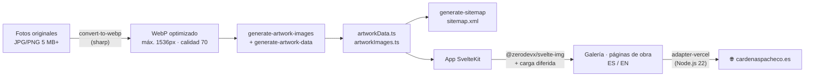

# Carmen Cárdenas Pacheco — Portfolio

**El portfolio web de la artista Carmen Cárdenas Pacheco: una galería online que muestra obra original (óleo, acrílico, grafito…) en alta resolución sin que la web pese ni tarde.**


### 🔗 Ver en vivo → **[cardenaspacheco.es](https://cardenaspacheco.es)**

---

## El problema

Un artista necesita enseñar su obra tal cual es: color fiel y detalle al máximo. Pero las fotos de cuadros pesan **5 MB o más** cada una, y una galería llena de ellas se vuelve lenta, mala para SEO y frustrante en móvil. Este proyecto resuelve la tensión entre **fidelidad visual** y **rendimiento**: sirve decenas de obras en alta resolución manteniendo una puntuación **Lighthouse 95+**, en español e inglés para llegar a más público.

## Cómo funciona

El original pesado nunca llega al navegador. Un pipeline en tiempo de build (`scripts/`) transforma las fotos de obra en assets ligeros y genera automáticamente los datos y el sitemap.



**Decisiones técnicas y su porqué:**

- **Conversión a WebP con `sharp`** (`scripts/convert-to-webp.mjs`): reescala a un máximo de 1536px y comprime a calidad 70. Convierte megabytes de foto original en archivos ligeros sin pérdida visible, y normaliza los nombres (sin acentos ni espacios) para URLs limpias.
- **Datos generados, no escritos a mano** (`generate-artwork-images` + `generate-artwork-data`): el script escanea la carpeta de imágenes, agrupa las variantes de zoom por obra y produce los `.ts` con las rutas. Añadir una obra es soltar su foto y regenerar.
- **Imágenes responsive con `@zerodevx/svelte-img` + carga diferida**: cada tarjeta sirve el tamaño justo para el dispositivo y solo carga lo que entra en pantalla, clave para el 95+ de Lighthouse.
- **Multiidioma con `svelte-i18n`** (ES por defecto, EN): diccionarios en `src/lib/locales/`, pensado también para SEO internacional.
- **`sitemap.xml` autogenerado** (`generate-sitemap.mjs`) a partir de los datos de obra: cada página `/artwork/[id]` queda indexable sin mantenimiento manual.
- **Cabeceras de seguridad y caché** (`vercel.json`): HSTS, anti-clickjacking y `Cache-Control` inmutable de un año para assets e imágenes.
- **`bigger-picture`** como visor/lightbox para ver cada obra ampliada sin librerías pesadas.

## Stack

| Capa | Tecnología |
|------|------------|
| Framework | Svelte 5 + SvelteKit |
| Lenguaje | TypeScript |
| Estilos | Tailwind CSS 4 · fuentes Fraunces + Inter |
| Imágenes | sharp (build) · @zerodevx/svelte-img · bigger-picture |
| i18n | svelte-i18n (ES / EN) |
| Iconos | lucide-svelte |
| Analítica | Vercel Analytics + Speed Insights |
| Despliegue | Vercel (`@sveltejs/adapter-vercel`, runtime Node.js 22) |

## En números

> - **95+** en rendimiento (Lighthouse)
> - **44** obras en la galería
> - **5 MB+** por foto original → **WebP** ligero (máx. 1536px, calidad 70)
> - **2** idiomas (español · inglés)
> - **0** entradas de datos escritas a mano: obras y sitemap se autogeneran

## Ejecutar en local

```bash
npm install

npm run dev        # servidor de desarrollo (Vite)
npm run build      # build de producción
npm run preview    # previsualizar el build
```

**Pipeline de imágenes y datos** (tras añadir nuevas fotos de obra):

```bash
npm run images:convert        # convierte originales a WebP con sharp
npm run generate-artwork-all  # regenera imágenes + datos de obra
npm run generate-sitemap      # regenera sitemap.xml
```

**Calidad de código:**

```bash
npm run check     # type-check con svelte-check
npm run lint      # ESLint
npm run format    # Prettier
```
